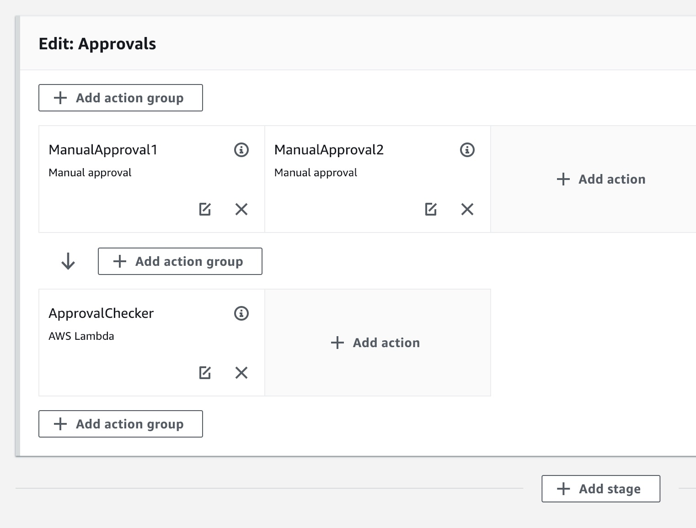
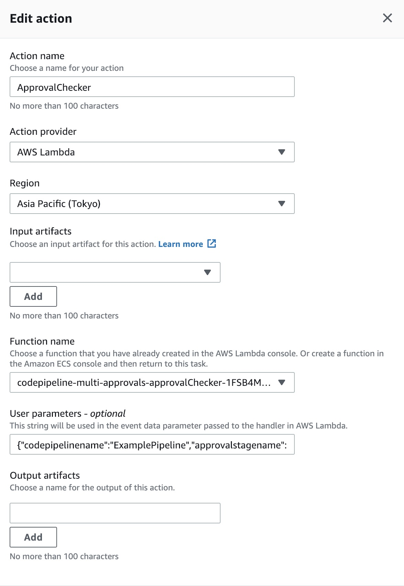

AWS CodePipeline multiple manual approvals
-----

## Overview

Serverless application that enable multiple manual approvals on AWS CodePipeline.
About [AWS CodePipeline manual approval](https://docs.aws.amazon.com/codepipeline/latest/userguide/approvals.html).

Many thanks to Forrest Brazeal for brilliant idea: [Enforcing the 'Two-Person Rule' with AWS CodePipeline](https://www.trek10.com/blog/enforcing-two-person-rule-aws-codepipeline/).

## Prerequisite

- nodejs8.10
- [aws-cli](https://aws.amazon.com/cli/)
- [aws-sam-cli](https://github.com/awslabs/aws-sam-cli)

## Setup AWS CodePipeline

AWS CodePipeline supports [AWS Lambda function invoking action](https://docs.aws.amazon.com/codepipeline/latest/userguide/actions-invoke-lambda-function.html).
You should setup a multiple approvals as follows:

1. Add a manual approvals stage

2. Add an action group with multiple manual approval actions

3. Add an `ApprovalChecker` action group below manual approval action group, that invokes the lambda function.

Note that, you **MUST** provide `User parameters` in following format: `{"codepipelinename":"YOUR PIPELINE NAME","approvalstagename":"YOUR MANUAL APPROVAL STAGE NAME AT STEP 1"}`.
So, your could use same function for handler multiple pipelines with difference `User Parameters`.

For examples:
- Assume that your pipeline's name is `ExamplePipeline`

- Create a multiple approvals stage with 2 manual approval actions:

||
|:--:|
|*Multiple approvals stage that named: `Approvals`*|

- `ApprovalChecker` action setting is as follows:

||
|:--:|
|*`ApprovalChecker` action's setting*|

- The `User parameters` is `{"codepipelinename":"ExamplePipeline","approvalstagename":"Approvals"}`

## Contribute

Please, create a pull request, I will check as soon as possible.
